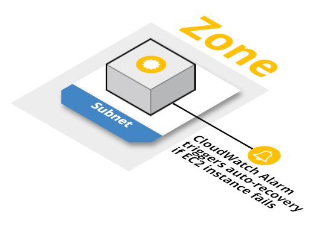

<iframe src="https://ghbtns.com/github-btn.html?user=widdix&repo=aws-cf-templates&type=star&count=true&size=large" frameborder="0" scrolling="0" width="160px" height="30px"></iframe>

> **New**: Manage Free Templates for AWS CloudFormation with the [widdix CLI](./cli/)

There are two approaches when it comes to managing EC2 instances: mutable and immutable.

A **mutable** EC2 instance is created once and then lives for many years. Humans log on to the machine (e.g., via SSH or RDP) and do their work. OS updates are applied to the running system; new packages are installed from time to time; configuration files are modified when needed. Deployments happen while the EC2 instance is running.

An **immutable** EC2 instance is never changed after creation. If you want to update the OS, you create a new EC2 instance that starts from a fresher image (AMI). If new packages are needed, a new AMI is created that contains those packages. If a new deployment is necessary, a new AMI is built and rolled out be replacing the EC2 instances. The EC2 instance is ephemeral and must not be used to persists data!

The EC2 templates follow both approaches, choose them according to your needs.

| Template ID             | Template Description     | Approach |
| ----------------------- | ------------------------ | --------- |
| `ec2/al2-managed`       | Amazon Linux 2 (managed) | mutable   |
| `ec2/ec2-auto-recovery` | EC2 with auto-recovery   | immutable |

# Amazon Linux 2 (managed)
This template describes an EC2 instance running Amazon Linux 2. If the instance fails it will be replaced automatically. All data stored on EBS volumes will still be available. The public and private IP address won't change. Auto-recovery does only work inside of a single availability zone (AZ). Backups happen during a backup window. OS Updates during maintenance window (Instance might be restarted). We recommend to use AWS Systems Manager to configure the instance.

## Installation Guide
1. This templates depends on one of our [`vpc-*azs.yaml`](./vpc/) templates. 
1. 
1. Click **Next** to proceed with the next step of the wizard.
1. Specify a name and all parameters for the stack.
1. Click **Next** to proceed with the next step of the wizard.
1. Click **Next** to skip the **Options** step of the wizard.
1. Check the **I acknowledge that this template might cause AWS CloudFormation to create IAM resources.** checkbox.
1. Click **Create** to start the creation of the stack.
1. Wait until the stack reaches the state **CREATE_COMPLETE**
1. Grab the public `IPAddress` of the EC2 instance from the **Outputs** tab of your stack.

## Dependencies
* `vpc/vpc-*azs.yaml` (**required**)
* `vpc/vpc-*-bastion.yaml` (recommended)
* `operations/alert.yaml` (recommended)
* `security/kms-key.yaml`
* `vpc/zone-*.yaml`

## Limitations
* Single point of failure: The EC2 instance runs in a single AZ. In case of an AZ outage the instance will be unavailable.
* No auto scaling (single instance)

# EC2 with auto-recovery
This template describes an EC2 instance with auto-recovery. If the instance fails it will be replaced automatically. All data stored on EBS volumes will still be available. The public and private IP address won't change. Auto-recovery does only work inside of a single availability zone (AZ).

## Installation Guide
1. This templates depends on one of our [`vpc-*azs.yaml`](./vpc/) templates. 
1. 
1. Click **Next** to proceed with the next step of the wizard.
1. Specify a name and all parameters for the stack.
1. Click **Next** to proceed with the next step of the wizard.
1. Click **Next** to skip the **Options** step of the wizard.
1. Check the **I acknowledge that this template might cause AWS CloudFormation to create IAM resources.** checkbox.
1. Click **Create** to start the creation of the stack.
1. Wait until the stack reaches the state **CREATE_COMPLETE**
1. Grab the public `IPAddress` of the EC2 instance from the **Outputs** tab of your stack.

## Dependencies
* `vpc/vpc-*azs.yaml` (**required**)
* `vpc/vpc-*-bastion.yaml` (recommended)
* `operations/alert.yaml` (recommended)
* `vpc/zone-*.yaml`

## Limitations
* Single point of failure: The EC2 instance runs in a single AZ. In case of an AZ outage the instance will be unavailable.
* No auto scaling (single instance)
* No backup (immutable EC2 instances do not require backups!)
