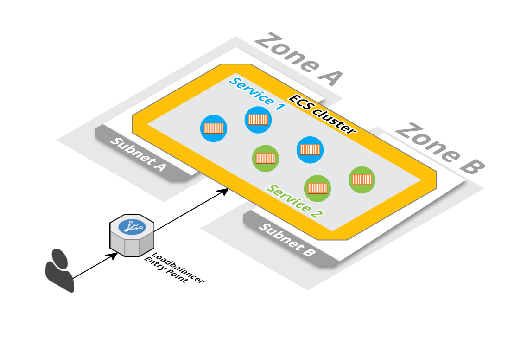
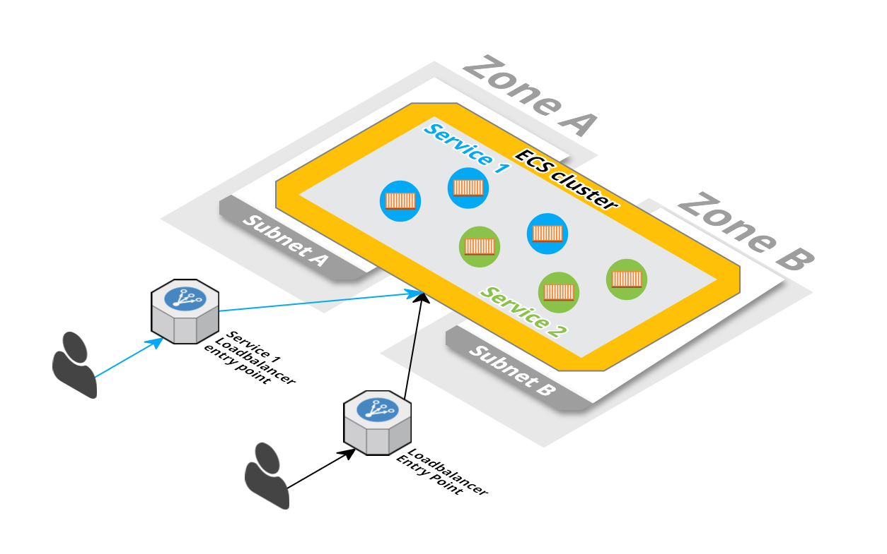

[EC2 Container Service (ECS)](https://aws.amazon.com/ecs/) is a highly scalable, fast, container management service that makes it easy to run, stop, and manage Docker containers on a cluster of Amazon EC2 instances. To run an application on ECS you need the following components:

* Docker image published to [Docker Hub](https://hub.docker.com/) or [EC2 Container Registry (ECR)](https://aws.amazon.com/ecr/)
* ECS cluster
* ECS service

We provide you templates for the ECS cluster and the service. You need to publish the Docker image.

# ECS cluster
This template describes a fault tolerant and scalable ECS cluster on AWS. The cluster scales the underlying EC2 instances based on memory and CPU reservation. In case of a scale down, the instance drains all containers before it is terminated.

## Installation Guide
1. This templates depends on our [`vpc-*azs.yaml`](../vpc/) template. 
1. 
1. Click **Next** to proceed with the next step of the wizard.
1. Specify a name and all parameters for the stack.
1. Click **Next** to proceed with the next step of the wizard.
1. Click **Next** to skip the **Options** step of the wizard.
1. Check the **I acknowledge that this template might cause AWS CloudFormation to create IAM resources.** checkbox.
1. Click **Create** to start the creation of the stack.
1. Wait until the stack reaches the state **CREATE_COMPLETE**

## Dependencies
* `vpc/vpc-*azs.yaml` (**required**)
* `vpc/vpc-ssh-bastion.yaml` (recommended)
* `security/auth-proxy-*.yaml`
* `operations/alert.yaml` (recommended)

# ECS service
This template describes a fault tolerant and scalable ECS service on AWS. The service scales based on CPU utilization.

> The image needs to expose port 80 or the `AWS::ECS::TaskDefinition` needs to be adjusted!

We provide two service templates:
* `service-cluster-alb.yaml` uses the cluster's load balancer and path and/or host based routing.
* `service-dedicated-alb.yaml` includes a dedicated load balancer (ALB).

## Using the cluster's load balancer and path and/or host based routing
This template describes a fault tolerant and scalable ECS service that uses the cluster's load balancer and path and/or host based routing.

### Installation Guide
1. This templates depends on our [`cluster.yaml`](../ecs/) template. 
1. 
1. Click **Next** to proceed with the next step of the wizard.
1. Specify a name and all parameters for the stack.
1. Click **Next** to proceed with the next step of the wizard.
1. Click **Next** to skip the **Options** step of the wizard.
1. Check the **I acknowledge that this template might cause AWS CloudFormation to create IAM resources.** checkbox.
1. Click **Create** to start the creation of the stack.
1. Wait until the stack reaches the state **CREATE_COMPLETE**

### Dependencies
* `ecs/cluster.yaml` (**required**)
* `operations/alert.yaml` (recommended)

## Using a dedicated load balancer for the service
This template describes a fault tolerant and scalable ECS service that uses a dedicated load balancer for the service.

### Installation Guide
1. This templates depends on our [`cluster.yaml`](../ecs/) template. 
1. 
1. Click **Next** to proceed with the next step of the wizard.
1. Specify a name and all parameters for the stack.
1. Click **Next** to proceed with the next step of the wizard.
1. Click **Next** to skip the **Options** step of the wizard.
1. Check the **I acknowledge that this template might cause AWS CloudFormation to create IAM resources.** checkbox.
1. Click **Create** to start the creation of the stack.
1. Wait until the stack reaches the state **CREATE_COMPLETE**

### Dependencies
* `vpc/vpc-*azs.yaml` (**required**)
* `ecs/cluster.yaml` (**required**)
* `operations/alert.yaml` (recommended)
